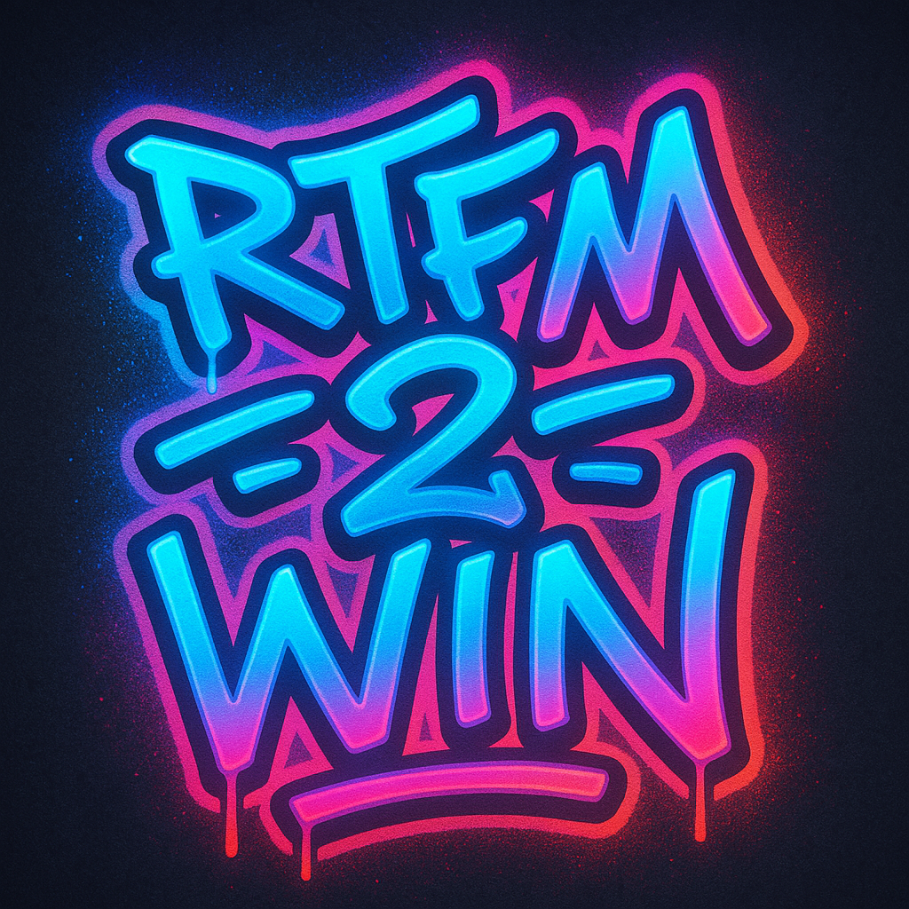

# RTFM - Quiz & Apprentissage Interactif




<p align="center">
  <!-- Technologies -->
  
  
  
  
  
  
  


</p>

## 🚀 À propos du projet

RTFM est une plateforme moderne d'apprentissage et de quiz interactifs conçue pour rendre l'éducation plus engageante et amusante. La plateforme permet aux utilisateurs de participer à des quiz en temps réel, de rejoindre des tournois, de relever des défis et de suivre leur progression d'apprentissage.

### Principales fonctionnalités

- **Quiz interactifs en temps réel** : Participez à des sessions de quiz avec des questions à choix multiples, minutées et dynamiques
- **Mode Battle Royale** : Compétitions intenses où seuls les meilleurs restent en lice
- **Tournois** : Organisez et participez à des tournois avec plusieurs rounds et matchs
- **Système de récompenses** : Gagnez des badges, trophées et points d'expérience
- **Statistiques d'apprentissage** : Suivez votre progression et identifiez vos points forts/faibles
- **Personnalisation** : Thèmes, avatars et préférences sonores personnalisables
- **Exportation PDF** : Exportez les résultats et certificats en PDF
- **Mode hors ligne** : Accédez à certaines fonctionnalités même sans connexion

## 🛠️ Technologies

### Backend (API)
- **Laravel 12** - Framework PHP moderne et robuste
- **PHP 8.3** - Avec typage strict et dernières fonctionnalités
- **MySQL/MariaDB** - Base de données relationnelle
- **Sanctum** - Authentification API sécurisée
- **WebSockets** - Communication en temps réel
- **DomPDF** - Génération de PDF
- **Scribe** - Documentation API automatisée

### Frontend
- **Next.js 15** - Framework React avec rendu côté serveur
- **React 19** - Bibliothèque UI réactive
- **TypeScript** - Typage statique pour JavaScript
- **Tailwind CSS 4** - Utilitaires CSS pour design moderne
- **Zustand** - Gestion d'état simplifiée
- **Framer Motion** - Animations fluides et interactives
- **Socket.io** - Communication en temps réel avec le serveur
- **Three.js/React Three Fiber** - Effets 3D et visuels immersifs

## 🏗️ Architecture

L'application suit une architecture moderne avec une séparation claire entre frontend et backend :

- **API RESTful** - Architecture orientée ressources avec endpoints bien définis
- **WebSockets** - Communication bidirectionnelle en temps réel
- **MVC** - Modèle-Vue-Contrôleur pour le backend
- **ORM** - Eloquent pour la manipulation des données
- **Composants réutilisables** - Architecture frontend modulaire
- **Design responsive** - S'adapte à toutes les tailles d'écran

## 🚀 Installation

### Prérequis
- PHP 8.3+
- Composer 2+
- Node.js 18+
- MySQL/MariaDB 10.5+

### Backend (API)
```bash
# Cloner le dépôt
git clone https://github.com/Laurent-studi/rtfmlara.git
cd rtfmlara/api

# Installer les dépendances
composer install

# Copier le fichier d'environnement
cp .env.example .env

# Générer la clé d'application
php artisan key:generate

# Configurer la base de données dans .env
# DB_CONNECTION=mysql
# DB_HOST=127.0.0.1
# DB_PORT=3306
# DB_DATABASE=rtfm
# DB_USERNAME=root
# DB_PASSWORD=

# Lancer les migrations et seeders
php artisan migrate --seed

# Démarrer le serveur de développement
php artisan serve
```

### Frontend
```bash
# Aller dans le dossier frontend
cd ../frontend-site

# Installer les dépendances
npm install
# ou
pnpm install

# Copier le fichier d'environnement
cp .env.example .env.local

# Démarrer le serveur de développement
npm run dev
# ou
pnpm dev
```

## 📊 Structure du projet

```
rtfmlara/
├── api/ - Backend Laravel
│   ├── app/
│   │   ├── Http/Controllers/Api/ - Contrôleurs API
│   │   ├── Models/ - Modèles Eloquent
│   │   ├── Services/ - Services métier
│   │   └── ...
│   ├── routes/ - Définition des routes API
│   ├── database/ - Migrations et seeders
│   └── ...
└── frontend-site/ - Frontend Next.js
    ├── app/ - Routes et pages Next.js
    ├── components/ - Composants React réutilisables
    ├── lib/ - Utilitaires et services
    ├── hooks/ - Hooks React personnalisés
    └── ...
```

## 🤝 Contribution

Les contributions sont les bienvenues ! Veuillez suivre ces étapes :

1. Forkez le projet
2. Créez une branche pour votre fonctionnalité (`git checkout -b feature/amazing-feature`)
3. Committez vos changements (`git commit -m 'Add some amazing feature'`)
4. Poussez vers la branche (`git push origin feature/amazing-feature`)
5. Ouvrez une Pull Request

## 📝 Licence

Ce projet est sous licence [MIT](LICENSE).

## 📧 Contact

Pour toute question ou suggestion, n'hésitez pas à me contacter.

---

Développé avec ❤️ par Laurent 